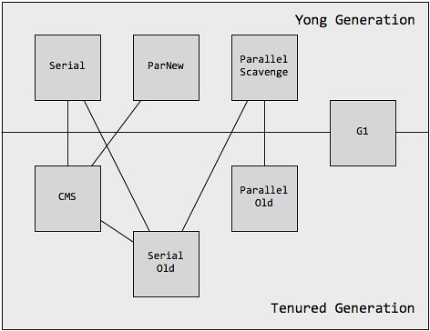

# Offer 直通车——GC

* 标记算法

  * 对象被判定为垃圾的标准

    没有被其他对象引用（不再被引用的对象）

  * 判定对象是否为垃圾的算法

    * 引用计数算法

      通过判断对象的引用数量来决定对象是否可以被回收；每个对象实例都有一个引用计数器，被引用则加 1，完成引用则减 1；任何引用计数为 0 的对象实例可以被当做垃圾收集。

      优点：执行效率高（找到引用计数为 0 的对象实例），程序执行受影响较小

      缺点：无法检测出循环引用的情况，导致内存泄露

    * 可达性分析算法

      通过判断对象的引用链是否可达（GC Root）来决定对象是否可以被回收。

      可以作为 GC Root 的对象：

      虚拟机栈中引用的对象（栈帧中的局部变量表）

      方法区（MetaSpace）中的常量引用的对象

      方法区（MetaSpace）中的类静态属性引用的对象

      本地方法栈中 JNI（Native 方法）的引用对象

      活跃线程的引用对象

* 回收算法

  * 标记清除算法（Mark and Swap）

    标记：从根集合进行扫描，对存活的对象进行标记

    清除：对堆内存从头到尾进行线性遍历，回收不可达对象内存

    缺陷：碎片化

  * 复制算法（Copying）

    分为对象面和空闲面；对象在对象面上创建；存活的对象被从对象面复制到空闲面；将对象面所有对象内存清除

    解决碎片化问题；顺序分配内存，简单高效；适用于对象存活率低的场景

  * 标记整理算法（Compacting）

    标记：从根集合进行扫描，对存活的对象进行标记

    清除：移动所有存活的对象，且按照内存地址次序依次排列，然后将末端内存地址以后的内存全部回收

    避免内存的不连续性（碎片化）；不用设置两块内存互换；适用于存活率高的场景

  * 分代收集算法（Generational Collector）

    垃圾回收算法的组合拳；按照对象生命周期的不同划分区域以采用不同的垃圾回收算法；以提高 JVM 回收效率

    jdk6、jdk7 -> Young Generation，Old Generation，Permanent Generation

    jdk8 -> Young Generation，Old Generation

* 分代收集算法

  * GC 的分类

    Minor GC：复制算法，Young Generation

    Major GC：标记清除算法、标记整理算法，Old Generation

    Full GC：清理整个堆空间，Old Generation & Young Generation

    我们不用去关心到底是叫 Major GC 还是 Full GC，大家应该关注当前的 GC 是否停止了所有应用程序的线程，还是能够并发的处理而不用停掉应用程序的线程

  * Young Generation（1/3 堆空间，复制算法）

    尽可能快速地收集掉那些生命周期短的对象

    Eden 区 -> 8/10，Survivor 区（From 区 -> 1/10、To 区 -> 1/10）

    首次 Minor GC：如果 Eden 区满，触发 Minor GC，将 Eden 区中的存活对象复制到 From 区，年龄加 1，并清除 Eden 区

    再次 Minor GC：如果 Eden 区满，触发 Minor GC，将 Eden 区和 From 区中的存活对象复制到 To 区，年龄加 1，并清除 Eden 区和 From 区

    周而复始，当存活对象的年龄达到 -XX:MaxTenuringThreshold（默认 15），或 Survivor 区存放不下对象，或新生成的大对象 -XX:+PretenderSizeThreshold，移动到 Old Generation

  * Old Generation（2/3 堆空间，标记清除算法、标记整理算法）

    存放生命周期较长的对象

    Full GC 和 Major GC

    Full GC 比 Minor GC 慢，但执行频率低

    触发 Full GC 的条件：老年代空间不足；永久代空间不足（jdk7）；CMS GC 时出现 promotion failed，concurrent mode failure；Minor GC 晋升到老年代的平均大小大于老年代的剩余空间；调用 System.gc()；使用 RMI 来进行 RPC 或管理的 JDK 应用，每小时执行一次 Full GC

  * 常用的调优参数

    -XX:SurvivorRatio：调整 Eden 和 Survivor 的比值，默认 8:2

    -XX:NewRatio：老年代和年轻代内存大小的比例

    -XX:MaxTenuringThreshold：对象从年轻代晋升到老年代经过 GC 次数的最大阈值

  * Stop-the-World

    JVM 由于要执行 GC 而停止了应用程序的执行

    任何一种 GC 算法中都会发生

    多数 GC 优化通过减少 Stop-the-World 发生的时间来提高程序性能

  * SafePoint

    分析过程中对象引用关系不会发生变化的点

    产生 SafePoint 的地方：方法调用；循环跳转；异常跳转等

    （之所以选择这些位置作为 SafePoint 的插入点，主要的考虑是“避免程序长时间运行而不进入 SafePoint”，比如 GC 的时候必须要等到 Java 线程都进入到 SafePoint 的时候 VMThread 才能开始执行 GC，如果程序长时间运行而没有进入 SafePoint，那么GC也无法开始，JVM 可能进入到 Freezen  假死状态）

    安全点数量得适中

* 垃圾收集器

  

  * [Reference](https://blog.csdn.net/coderlius/article/details/79272773)

    **串行收集器**：Serial + Serial Old（Client 模式下默认的收集器）

    **并行收集器**：Parallel Scavenge + Parallel Old（关注吞吐量，Server 模式下的默认收集器）

    **并发标记清除收集器**：ParNew + CMS + Serial Old（关注延迟）

    由于和应用线程并发进行，CMS 必须要在老年代堆内存用尽之前完成垃圾回收，否则 CMS 回收失败时，将触发担保机制，串行老年代收集器将会以 STW 的方式进行一次 GC，从而造成较大停顿时间

    标记清除算法无法整理空间碎片，老年代空间会随着应用时长被逐步耗尽，最后将不得不通过担保机制对堆内存进行压缩（-XX:CMSFullGCsBeForeCompaction 指定多少次 CMS 收集之后，进行一次压缩的 Full GC）

    **Garbage First（G1）**：关注延迟

    G1 的设计原则是首先收集尽可能多的垃圾（Garbage First）。因此，G1 并不会等内存耗尽（串行、并行收集器）或者快耗尽（CMS）的时候开始垃圾收集，而是在内部采用了启发式算法，在老年代找出具有高收集收益的分区进行收集

    G1 采用内存分区（Region）的思路，将内存划分为一个个相等大小的内存分区，回收时则以分区为单位进行回收，存活的对象复制到另一个空闲分区中

  * JVM 的运行模式

    Server（重量级的虚拟机，采用了更多的优化）；Client

    java -version -> Java HotSpot(TM) 64-Bit Server VM

  * 年轻代常见的垃圾收集器

    * Serial 收集器（-XX:+UseSerialGC，复制算法）

      单线程收集，进行垃圾收集时，必须暂停所有工作线程

      简单高效，Client 模式下默认的年轻代收集器

    * ParNew 收集器（-XX:+UseParNewGC，复制算法）

      多线程收集（默认为 CPU 核心数），其余的行为、特点和 Serial 收集器一样

      单核执行效率不如 Serial，在多核下执行才有优势

    * Parallel Scavenge 收集器（-XX:+UseParallelGC，复制算法）配合 -XX:+UseAdaptiveSizePolicy

      比起关注用户线程停顿时间，更关注系统的吞吐量（运行用户代码时间 / （运行用户代码时间 + 垃圾收集时间））

      主要适合在后台运算而不是太多交互的任务

      在多核下执行才有优势，Server 模式下默认的年轻代收集器

  * 老年代常见的垃圾收集器

    * Serial Old 收集器（-XX:+UseSerialOldGC，标记整理算法）

      单线程收集，进行垃圾收集时，必须暂停所有工作线程

      简单高效，Client 模式下默认的老年代收集器

    * Parallel Old 收集器（-XX:+UseParallelOldGC，标记整理算法）

      多线程，吞吐量优先

    * CMS 收集器（-XX:+UseConcMarkSweepGC，标记清除算法）

      几乎能与用户线程同时工作；适用于大内存和多 CPU；较多生命周期长的对象

      初始标记（多线程）：标记从 GC Root 直接可达的老年代对象；Stop-the-World

      并发标记：并发追溯标记（标记出根对象的可达路径），垃圾回收线程和应用线程同时运行；在并发标记过程中，由于应用线程还在运行，所以会导致有些对象会从新生代晋升到老年代，有些老年代的对象引用会被改变，有些对象会直接分配到老年代

      重新标记（多线程）：Stop-the-World；重新扫描堆中的对象

      并发清理：清理垃圾对象，程序不会停顿

      并发重置：重置 CMS 收集器的状态

    * Garbage First 收集器（-XX:+UseG1GC，复制 + 标记整理算法）

      特点：并行（多核缩短 Stop-the-World）和并发（和用户线程并发执行）；分代收集；空间整合；可预测的停顿

      将整个 Java 堆内存划分成多个大小相等的 Region

      年轻代和老年代不再物理隔离

* 强引用，软引用，弱引用，虚引用

  * 强引用（Strong Reference）

    Object obj = new Object();

    抛出 OutOfMemoryError 终止程序也不会回收具有强引用的对象

    通过将对象设置为 null 来弱化引用，使其被回收

  * 软引用（Soft Reference）

    只有当内存空间不足时，GC 会回收该引用的对象的内存

    可以用来实现高速缓存

    SoftReference\<String\> softRef = new SoftReference\<\>(str);

  * 弱引用（Weak Reference）

    GC 时会被回收，但被回收的概率也不大，因为 GC 线程优先级比较低

    适用于引用偶尔被使用且不影响垃圾回收的对象（缓存）

  * 虚引用（PhantomReference）

    不会决定对象的生命周期（昙花一现），任何时候都可能被垃圾收集器回收

    跟踪对象被垃圾收集器回收的活动，起哨兵作用

    必须和引用队列 ReferenceQueue 联合使用

    ReferenceQueue queue = new ReferenceQueue();

    PhantomReference ref = new PhantomReference(str, queue);

  * 引用队列（ReferenceQueue）

    无实际存储结构，存储逻辑依赖于内部节点之间的关系来表达

    存储关联的且被 GC 的软引用，弱引用以及虚引用