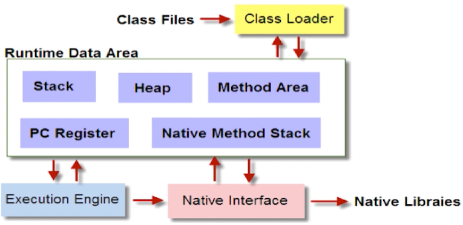
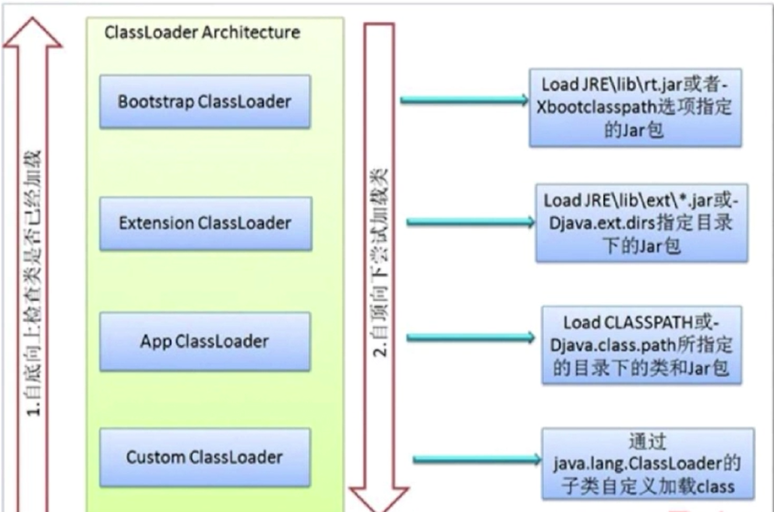
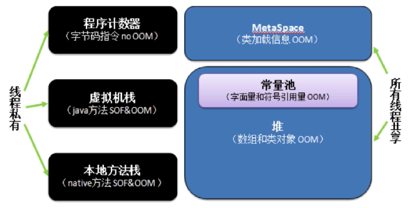
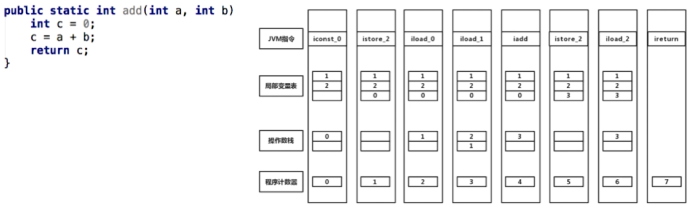

# Offer 直通车——JVM

* 平台无关性（Compile Once, Run Anywhere）

  编译期（javac，javap -c）

  运行期（java）

  Java 源码首先被编译成字节码（编译器），再由不同平台的 JVM 进行解析（解释器），Java 语言在不同的平台上运行时不需要进行重新编译，Java 虚拟机在执行字节码的时候，把字节码转换成具体平台上的机器指令。

  避免每次执行前进行语法检查；Scala、Groovy（兼容性）

* JVM 如何加载 .class 文件

  Java 虚拟机：屏蔽底层操作系统平台的不同

  

  Class Loader：依据特定格式，加载 class 文件到内存

  Execution Engine：对字节码进行解析（解释执行，JIT 编译执行）

  Native Interface（native）：融合不同开发语言的原生库为 Java 所用

  Runtime Data Area：JVM 内存空间结构模型

* 反射

  Java 反射机制是在运行状态中，对于任意一个类，都能够知道这个类的所有属性和方法；对于任意一个对象，都能够调用它的任意方法和属性；这种动态获取类信息以及动态调用对象方法的功能称为 Java 语言的反射机制。

  ```java
  Class clazz = Class.forName("xxx");
  Object obj = clazz.newInstance();
  Method m = clazz.getDeclaredMethod("xx", String.class);
  // IllegalAccessException
  m.setAccessible(true);
  m.invoke(obj, "x");
  
  // 获取某个类的所有声明的 public 方法，包括父类
  m = clazz.getMethod("xx", String.class);
  m.invoke(obj, "x");
  
  // 获取某个类的所有声明的字段，即包括 public、private 和 protected，但不包括父类
  Field field = clazz.getDeclaredField("xx");
  field.setAccessible(true);
  field.set(obj, "x");
  ```

* ClassLoader

  ClassLoader 负责通过将 Class 文件里的二进制数据流装载进系统，然后交给 Java 虚拟机进行连接、初始化等操作。

  * 查看 Java 类加载顺序

    java -verbose

  * ClassLoader 的种类

    BootStrapClassLoader：由 C++ 编写，加载核心库 java.*，JRE/lib/rt.jar。`-Xbootclasspath`

    ExtClassLoader（Platform ClassLoader）：由 Java 编写，加载扩展库 javax.*，JRE/lib/ext/\*.jar，`System.getProperty("java.ext.dirs")`

    AppClassLoader：由 Java 编写，加载程序所在目录，`System.getProperty("java.class.path")`

    自定义 ClassLoader：由 Java 编写，定制化加载

  * ExtClassLoader 的父类加载器是 null，只不过在默认的 ClassLoader 的 loadClass 方法中，当 parent 为 null 时，是交给 BootStrapClassLoader 来处理的

  * 自定义 ClassLoader 的实现

    loadClass()：先从已经加载的类中寻找，如没有则继续从父 ClassLoader 中寻找，如仍然没找到，则从 BootstrapClassLoader 中寻找，最后再调用 findClass 方法来寻找

    findClass()：以自定义的方式加载相应的类

    defineClass()：将二进制的字节码转换为 Class 对象

    ```java
    protected Class<?> findClass(String name) throws ClassNotFoundException {
        throw new ClassNotFoundException(name);
    }
    
    protected final Class<?> defineClass(String name, byte[] b, int off, int len) throws ClassFormatError {}
    ```

    ```java
    public class CustomClassLoader extends ClassLoader {
        // 类加载路径
        private String path;
    
        @Override
        public Class findClass(String name) {
            byte[] b = loadClassData(name);
            return defineClass(name, b, 0, b.length);
        }
    
        // ASM
        private byte[] loadClassData(String name) {
            String pathName = path + name + ".class";
        }
    }
    ```

  * ClassLoader 的双亲委派机制

    

    向上询问是否已加载；逐层尝试是否可加载

  * 为什么使用双亲委派机制去加载类

    避免加载多份同样的字节码

  * 类的加载方式

    new、ClassLoader.loadClass()、Class.forName()

  * 类的装载过程

    加载（通过 ClassLoader 加载 class 文件字节码，生成 Class 对象）

    链接：校验（检查加载的 class 的正确性和安全性）；准备（为类变量分配存储空间并设置类变量的初始值）；解析（JVM 将常量池内的符号引用转换为直接引用）

    初始化（执行类变量赋值和静态代码块）

  * loadClass 和 forName 的区别

    Class.forName 得到的 class 是已经初始化（Init）完成的；ClassLoader.loadClass 得到的 class 是还没有链接（Link）的。

    ```java
    // Spring IOC lazy loading
    ClassLoader loader = Rott.class.getClassLoader();
    Class clazz = Class.forName("com.mysql.jdbc.Driver");
    ```

* JVM 内存模型

  * 线程角度

    

    线程私有：程序计数器、虚拟机栈、本地方法栈

    线程共享：MetaSpace、堆

  * 程序计数器（Program Counter Register）

    当前线程所执行的字节码行号指示器（逻辑而非物理）

    改变计数器的值来选取下一条需要执行的字节码指令

    “线程私有”（在任何一个确定的时刻，一个处理器只会执行一个线程中的指令，为了保证线程切换后恢复正确的执行字节码指令的位置）

    对 Java 方法计数，Native 方法则计数器值为 Undefined

    不会发生内存泄露

  * Java 虚拟机栈（Stack）

    

    Java 方法执行的内存模型

    包含多个栈帧（每个方法被执行时都会创建一个栈帧）；栈帧用于存储局部变量表（Local Variable Table）、操作栈（Operand Stack）、动态链接（Dynamic Linking）、返回地址（Return Address）等

    * 局部变量表和操作栈

      局部变量表：包含方法执行过程中的所有变量

      操作数栈：入栈、出栈、复制、交换、产生消费变量

    * StackOverflowError

      ```java
      // F(0) = 0, F(1) = 1, 当 n >= 2，F(n) = F(n - 1) + F(n - 2)
      public class Fibonacci {
          public static int fibonacci(int n) {
              if (n == 0) { return 0; }
              if (n == 1) { return 1; }
              return fibonacci(n - 1) + fibonacci(n - 2);
          }
      }
      ```

      递归过深，栈帧数超过虚拟机栈深度 -> 限制递归的深度，使用循环替换递归

    * OutOfMemoryError

      建立新线程的时候没有足够的内存去创建对应的虚拟机栈

      ```java
      public void stackLeakByThread() {
          while (true) {
              new Thread() {
                  public void run() {
                      while(true) {}
                  }
              }.start();
          }
      }
      ```

  * 本地方法栈

    与虚拟机栈相似，主要作用于标注了 native 的方法

  * 元空间（MetaSpace）与永久代（PermGen）

    都是存储 class 的相关信息（Method，Field），在 jdk8 后使用元空间替代了永久代

    元空间使用本地内存，而永久代使用的是 jvm 的内存（java.lang.OutOfMemoryError: PermGen space）；MetaSpace 没有字符串常量池（jdk7 将字符串常量池移动到了堆中）

    字符串常量池存在永生代中，容易出现性能问题和内存溢出

    类和方法的信息大小难以确定，给永久代的大小指定带来困难

    永久代会为 GC 带来不必要的复杂性

    方便 HotSpot 与其他 JVM 如 Jrockit 的集成

  * Java 堆（Heap）

    对象实例的分配区域

    GC 管理的主要区域

  * 内存角度

    ```java
    public class HelloWorld {
        private String name;
        public void setName(String name) {
            this.name = name;
        }
        public void sayHello() {
            System.out.println("Hello " + name);
        }
        public static void main(String[] args) {
            int a = 1;
            HelloWorld hw = new HelloWorld();
            hw.setName("test");
            hw.sayHello();
        }
    }
    ```

    元空间

    Class：HelloWorld，System

    Method：sayHello，setName，main

    Field：name

    Java 堆

    Object：String("test")，HelloWorld

    线程独占

    Parameter reference："test" to String object

    Variable reference：hw to HelloWorld object

    Local Variables：a with 1，lineNo

* -Xms -Xmx -Xss 的含义

  -Xss：规定了每个线程虚拟机栈（堆栈）的大小

  -Xms：堆的初始值

  -Xmx：堆的最大值

* Java 内存模型中堆和栈

  * 内存分配策略

    静态存储：编译时确定每个数据目标在运行时的存储空间需求（不允许可变数据结构、嵌套、递归的存在）

    栈式存储：数据区需求在编译时未知，运行时模块入口前确定

    堆式存储：编译时或运行时模块入口都无法确定，动态分配

  * 联系

    引用对象、数组时，栈里定义变量保存堆中目标的首地址

  * 区别

    管理方式（栈自动释放，堆需要 GC）

    空间大小（栈比堆小）

    碎片相关（栈产生的碎片远小于堆）

    分配方式（栈支持静态和动态分配，而堆仅支持动态分配）

    效率（栈的效率比堆高）

* 不同版本之间的 intern() 方法的区别（jdk6、jdk6+）

  jdk6：当调用 intern 方法时，如果字符串常量池先前已创建出该字符串对象，则返回池中的该字符串的引用。否则，将此字符串对象添加到字符串常量池中（java.lang.OutOfMemoryError: PermGen space -> 永久代 -XX:MaxPermSize= -XX:PermSize=），并且返回该字符串对象的引用。

  jdk6+：当调用 intern 方法时，如果字符串常量池先前已创建出该字符串对象，则返回池中的该字符串的引用。否则，如果该字符串对象已经存在于 Java 堆中，则将堆中对此对象的引用添加到字符串常量池中，并且返回该引用；如果堆中不存在，则在池中创建该字符串并返回其引用。

  ```java
  // 使用引号声明的字符串都会直接在字符串常量池中生成
  String s1 = new String("a");
  s1.intern();
  String s2 = "a";
  // jdk6 false，jdk6+ false
  System.out.println(s1 == s2);
  
  String s3 = new String("a") + new String("a");
  s3.intern();
  String s4 = "aa";
  // jdk6 false（副本），jdk6+ true（引用）
  System.out.println(s3 == s4);
  ```