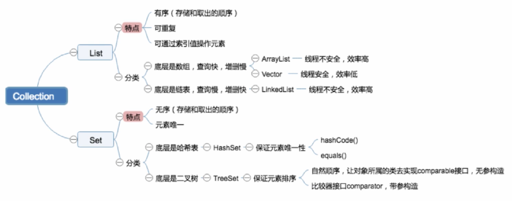
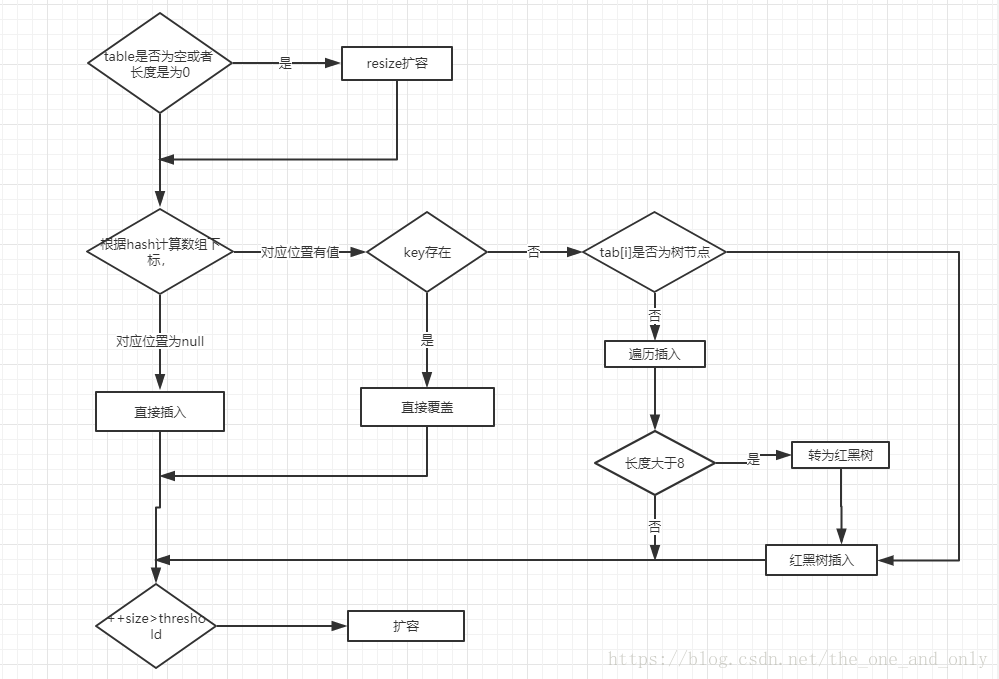

# Offer 直通车——Java 常用类库

* Java 异常体系

  * 异常处理机制回答了三个问题

    异常类型回答了什么被抛出；异常堆栈跟踪回答了在哪抛出；异常信息回答了为什么被抛出

  * Error 和 Exception

    Error：StackOverflowError；OutOfMemoryError

    Exception：捕获后可能恢复

    RuntimeException：不可预知的，程序应当自行避免（NullPointerException）

    CheckedException：可预知的，编译器校验的异常（IOException）

  * 常见 Error 和 Exception

    RuntimeException：NullPointerException，ClassCastException，IllegalArgumentException，IndexOutOfBoundsException，NumberFormatException

    CheckedException：ClassNotFoundException（Class.forName 或者 ClassLoader.loadClass），IOException

    Error：NoClassDefFoundError（JVM在加载一个类的时候，如果这个类在编译时是可用的，但是在运行时找不到这个类的定义）；StackOverflowError；OutOfMemoryError

  * try / catch / finally

    finally 先于 catch 中的 return 执行；顺序匹配一个 catch

  * Java 异常的处理原则

    具体明确：抛出的异常应能通过异常类名和 message 准确说明异常的类型和产生异常的原因

    提早抛出：应尽可能早的发现并抛出异常，便于精确定位问题

    延迟捕获：异常的捕获和处理应尽可能延迟，让掌握更多信息的作用域来处理异常

  * 高效主流的异常处理框架（org.springframework.core.NestedRuntimeException）

    设计一个通用的继承自 RuntimeException 的异常（AppException）来统一处理，其余异常都统一转译为上述异常。在 catch 之后，抛出上述异常的子类，并提供足以定位的信息，由前端接收 AppException 做统一处理

  * Java 异常处理消耗性能的地方

    异常对象实例需要保存栈快照等信息，开销较大

* Collection 体系

  * 数据结构和算法

    * 数据结构考点

      数组和链表的区别；链表（双向链表，循环链表）的操作，如反转，链表环路检测；队列、栈的应用；二叉树的遍历方式及其递归和非递归的实现；红黑树的旋转

    * 算法考点

      内部排序：递归排序、交换排序（冒泡、快速）、选择排序、插入排序

      外部排序：如何利用有限的内存配合海量的外部存储来处理超大的数据集

    * 算法考点扩展

      排序稳定性；不同数据集，各种排序最好或最差的情况；如何优化算法（如空间换时间）

  * Java 集合框架（List 和 Set）

    

    Vector 不是线程安全的

    ```java
    // put-if-absent
    if (!vector.contains(element)) {
        vector.add(element);
    }
    ConcurrentHashMap.putIfAbsent(key, obj)
    ```

    TreeSet 中 comparator 优先于 comparable

  * HashMap

    Java 8 之前，数组（默认 16，hash(key.hashCode()) % len） + 链表；性能恶化，从O(1) 到 O(n)；Entry

    Java 8 及以后，数组 + 链表 + 红黑树；TREEIFY_THRESHOLD = 8，MIN_TREEIFY_CAPACITY = 64， UNTREEIFY_THRESHOLD = 6， DEFAULT_LOAD_FACTOR = 0.75f；性能恶化情况下，从 O(n) 到 O(logn)；Node

    构造函数：延迟创建

    * put 逻辑

      

      若 HashMap 未被初始化，则进行初始化操作（resize）

      对 key 求 hash 值，依据 hash 值计算下标，若未发生碰撞，则直接放入桶中；若发生碰撞，且节点已经存在，则用新值替换旧值，否则判断是否为树节点，如果不是，以链表的方式链接，如果是，红黑树插入

      若链表长度超过阈值（TREEIFY_THRESHOLD = 8），且 HashMap 元素超过最低树化容量（MIN_TREEIFY_CAPACITY = 64），则将链表转为红黑树

      若桶满了（默认容量 16 * 扩容因子 0.75），就需要 resize（扩容一倍，然后重新计算每个元素在数组中的位置）

    * 如何有效减少碰撞

      扰动函数：促使元素位置分布均匀，减少碰撞几率

      使用 final 对象（如 String），并采用合适的 equals() 和 hashCode() 方法

      哈希碰撞的概率取决于 hashCode 计算方式和空间容量大小

    * hash

      hash = (h = key.hashCode()) ^ (h >>> 16) -> (n - 1) & hash

      \>>> 无符号右移；^ 位异或；& 位与操作

      n 为 table 数组长度

      不使用 key.hashCode() 的原因：key.hashCode() 返回 int，int 范围 -2^31 - 2^31-1

      (h = key.hashCode()) ^ (h >>> 16)：高低位都参与到 hash 运算中

      (n - 1) & hash：利用位与操作替代取模操作（hash % len），因为 HashMap 数组长度总是 2^n（tableSizeFor(initialCapacity)）

    * resize 扩容问题

      多线程环境下，调整大小会存在条件竞争，容易造成死锁

      rehashing 是一个比较耗时的过程

    * 自己实现 HashMap

    * Collections.synchronizedMap(hashMap)

      返回一个 SynchronizedMap 类的对象，而在 SynchronizedMap 类中使用了 synchronized 同步关键字来保证对 Map 的操作是线程安全的

      Object mutex;

      synchronized (mutex) {}

  * ConcurrentHashMap

    通过锁细粒度化，将整锁拆解成多个锁进行优化；早期的 ConcurrentHashMap 通过分段锁 Segment 来实现（默认为 16）；数组 + 链表

    当前的 ConcurrentHashMap 使用 CAS + synchronized 使锁更细化（首先使用无锁操作 CAS 插入头节点，失败则循环重试；若头节点已存在，则尝试获取头节点的同步锁，再进行操作）；数组 + 链表 + 红黑树

    * sizeCtl

      // Table initialization and resizing control.

      private transient volatile int sizeCtl;

    * key != null && value != null

    * put 逻辑

      判断 Node 数组是否初始化，没有则进行初始化操作

      通过 hash 定位数组的索引坐标，是否有 Node 节点，如果没有则使用 CAS 进行添加（链表的头节点），添加失败则进入下次循环

      有 Node 节点且检查到内部正在扩容，就帮助它一块扩容

      如果 f != null，则使用 synchronized 锁住 f 元素（链表、红黑树的头元素），如果是 Node 则执行链表的添加操作，如果是 TreeNode 则执行树的添加操作

      判断链表长度达到临界值 8，就将链表结构转换为树结构

      增加元素计算器，并扩容（如需要）

    * size() 方法和 mappingCount() 方法

      size() - Integer.MAX_VALUE

      mappingCount() - Long

      size() - 遍历 2 次或 3 次则加锁遍历，count 为返回结果，modCount 为是否被修改的依据，只增不减

      mappingCount() - 不需要借助锁，baseCount + counterCells

  * HashTable

    早期 Java 类库提供的哈希表实现；线程安全，涉及到修改 HashTable 的方法，使用 synchronized 修饰；串行化的方式运行，性能较差；数组 + 链表

  * HashMap、HashTable、ConcurrentHashMap

    HashMap 的 key、value 均可以为 null，其他的两个类不支持

* J.U.C

  java.util.concurrent 提供了并发编程的解决方案

  CAS 是 java.util.concurrent.atomic 包的基础

  AQS 是 java.util.concurrent.locks 包以及一些常用类，如 Semophore，ReentrantLock 等类的基础

  tools：CountDownLatch、CyclicBarrier、Semaphore、Exchanger

  collections：BlockingQueue（ArrayBlockingQueue、LinkedBlockingQueue、PriorityBlockingQueue）

* Java IO

  * BIO（同步阻塞）

    InputStream、OutputStream

    Reader、Writer

    Socket、ServerSocket、HttpUrlConnection

    ```java
    ServerSocket socket = new ServerSocket(port);
    while (true) {
        Socket s = socket.accept();
    }
    ```

  * NIO（多路复用、同步非阻塞；调用系统级别的 select、poll、epoll）

    Channels（FileChannel、DatagramChannel、SocketChannel、ServerSocketChannel）

    Selectors（DefaultSelectorProvider.create() 依据底层操作系统的不同而不同）

    Buffers（ByteBuffer 等基本数据类型、MappedByteBuffer 表示内存映射文件）

    ```java
    ServerSocketChannel channel = ServerSocketChannel.open();
    ServerSocket socket = channel.socket();
    InetSocketAddress address = new InetSocketAddress(port);
    socket.bind(address);
    channel.configureBlocking(false);
    Selector selector = Selector.open();
    channel.register(selector, SelectionKey.OP_ACCEPT);
    while (true) {
        selector.select();
        Set<SelectionKey> keys = selector.selectedKeys();
        Iterator<SelectionKey> iterator = keys.iterator();
        while (iterator.hasNext()) {
            SelectionKey key = (SelectionKey) iterator.next();
            iterator.remove();
            if (key.isAcceptable()) {}
            if (key.isReadable) {}
        }
    }
    ```

  * AIO（基于事件和回调机制）

    基于回调：实现 CompletionHandler 接口，调用时触发回调函数

    返回 Future：通过 isDone() 查看是否准备好，通过 get() 等待返回数据

    ```java
    AsynchronousServerSocketChannel channel = AsynchronousServerSocketChannel.open();
    InetSocketAddress address = new InetSocketAddress(port);
    channel.bind(port);
    channel.accept(null, new CompletionHandler<AsynchronousSocketChannel, Object>() {
        @Override
        public void completed(AsynchronousSocketChannel channel, Object attachment) {}
        @Override
        public void failed(Throwable throwable, Object attachment) {}
    });
    ```

  * FileChannel

    transferTo：把 FileChannel 中的数据拷贝到另一个 Channel

    transferFrom：把另一个 Channel 中的数据拷贝到 FileChannel

    避免了两次用户态和内核态间的上下文切换，即“零拷贝”，效率较高

  * select、poll、epoll

    * 支持一个进程所能打开的最大连接数

      select：单个进程所能打开的最大连接数由 FD_SETSIZE 宏定义，其大小是 32 个整数的大小（在 32 位的机器上，大小是 32 * 32，64 位机器上，大小是 32 * 64）

      poll：本质和 select 没有区别，但是它没有最大连接数的限制，原因是它是基于链表来存储的

      epoll：虽然连接数有上限，但是很大，1G 内存的机器上可以打开 10 万左右的连接

    * FD（文件句柄）剧增后带来的 IO 效率问题

      select / poll：因为每次调用时都会对连接进行线性遍历，所以随着 FD 的增加会造成遍历速度的“线性下降”

      epoll：由于 epoll 是根据每个 FD 上的 callback 函数来实现的，只有活跃的 socket 才会主动调用 callback，所以在活跃 socket 较少的情况下，使用 epoll 不会有“线性下降”，但是所有 socket 都很活跃的情况下，可能会有性能问题

    * 消息传递方式

      select / poll：内核需要将消息传递到用户空间，需要内核的拷贝动作

      epoll：通过内核和用户空间共享一块内存来实现，性能较高

  * BIO、NIO、AIO

    BIO：同步阻塞；线程数（server : client）为 1 : 1；吞吐量低；连接数较少且固定的架构

    NIO：同步非阻塞；线程数（server : client）为 1（selector）: N；吞吐量高；连接数多且连接短，如聊天服务器

    AIO：异步非阻塞；线程数（server : client）为 0 : N；吞吐量高；连接数多且连接长，如相册服务器