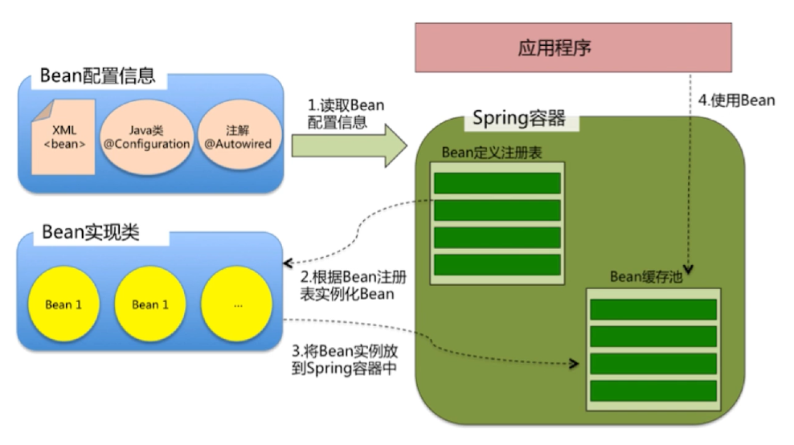
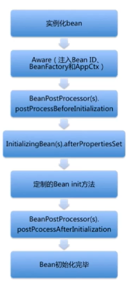

# Offer 直通车——Spring

* Spring IOC

  

  * IOC（Inversion of Control）& DI（Dependency Injection）

    Setter、Interface、Constructor、Annotation

    避免在各处使用 new 来创建类，并且可以做到统一维护

    创建实例的时候不需要了解其中的细节

  * Spring IOC 支持的功能

    依赖注入、依赖检查、自动装配、支持集合、指定初始化方法和销毁方法、支持回调方法

  * Spring IOC 容器的核心接口

    * BeanFactory

    * ApplicationContext（继承多个接口）

      BeanFactory：能够管理、装配 Bean

      ResourcePatternResolver：能够加载资源文件

      MessageSource：能够实现国际化等功能

      ApplicationEventPublisher：能够注册监听器，实现监听功能

    * BeanFactory 与 ApplicationContext

      BeanFactory 是 Spring 框架的基础设施，面向 Spring；ApplicationContext 面向使用 Spring 框架的开发者

  * refreshContext

    为 IOC 容器以及 Bean 的生命周期管理提供条件

    刷新 Spring 上下文信息，定义 Spring 上下文加载流程

  * getBean 逻辑

    转换 beanName；从缓存中加载实例；实例化 Bean；检测 parentBeanFactory；初始化依赖的 Bean；创建 Bean

  * Spring Bean 的作用域

    singleton：Spring 的默认作用域，容器里拥有唯一的 Bean 实例

    prototype：针对每个 getBean 请求，容器都会创建一个 Bean 实例

    request：会为每个 Http 请求创建一个 Bean 实例

    session：会为每个 Session 创建一个 Bean 实例

    globalSession：仅仅在基于 Portlet 的 Web 应用中才有意义

  * Spring Bean 的生命周期

    * 创建

      

    * 销毁

      若实现了 DisposableBean 接口，则会调用 destroy 方法

      若配置了 destry-method 属性，则会调用其配置的销毁方法

* Spring AOP

  * 关注点分离（不同的问题交给不同的部分去解决）

    面向切面编程 AOP 正是此种技术的体现；通用化功能代码的实现，对应的就是所谓的切面（Aspect）；业务功能代码和切面代码分开后，架构将变得高内聚低耦合；确保功能的完整性，切面最终需要被合并到业务中（Weave）

  * AOP 的三种织入方式

    编译时织入（需要特殊的 Java 编译器，如 AspectJ）；类加载时织入（需要特殊的 Java 编译器，如 AspectJ）；运行时织入（Spring 采用的方式，通过动态代理的方式，实现简单）

  * AOP 相关概念

    Aspect、Target、Join Point、Pointcut、Advice、Weaving

    Advice 的种类：前置通知（Before）、后置通知（AfterReturning）、异常通知（AfterThrowing）、最终通知（After）、环绕通知（Around）

  * RequestContextHolder

    ```java
    RequestAttributes requestAttributes = RequestContextHolder.currentRequestAttributes();
    HttpServletRequest request = ((ServletRequestAttributes)requestAttributes).getRequest();
    ```

  * AOP 的实现（JdkProxy 和 Cglib）

    由 AopProxyFactory 根据 AdvisedSupport 对象的配置来决定；默认策略为，如果目标类是接口，则用 JdkProxy 来实现，否则用 Cglib

    JdkProxy 的核心为 InvocationHandler 接口和 Proxy 类，通过 Java 的内部反射机制实现，反射机制在生成类的过程中比较高效

    Cglib 以继承的方式动态生成目标类的代理（不适用于被声明为 final 的类），借助 ASM 通过修改字节码实现，ASM 在生成类之后的执行过程中比较高效

  * 代理模式

    接口 + 真实实现类 + 代理类，真实实现类和代理类都要实现这个接口

  * Spring 中代理模式的实现

    真实实现类的逻辑包含在 getBean 方法里；getBean 方法返回的是代理类；代理类是 Spring 采用 JdkProxy 和 Cglib 动态生成的（Spring AOP 只能作用于 Spring 容器中的 Bean）

    DefaultAopProxyFactory.createAopProxy

* Spring 事务

  * ACID
  * 隔离级别
  * 事务传播