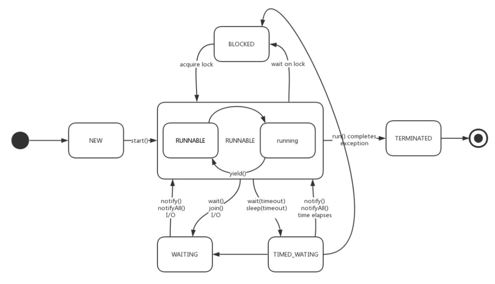
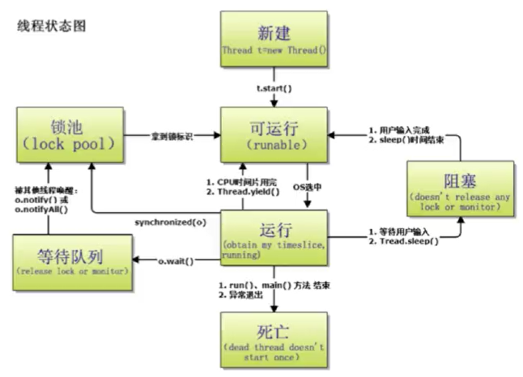
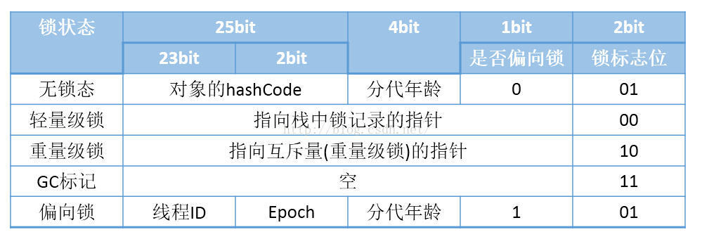
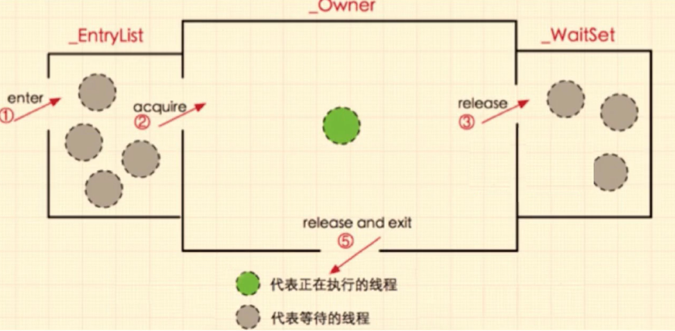
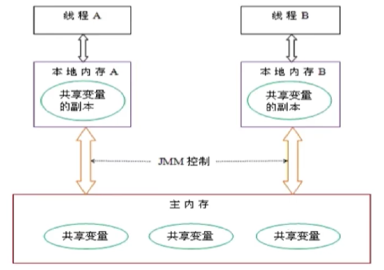
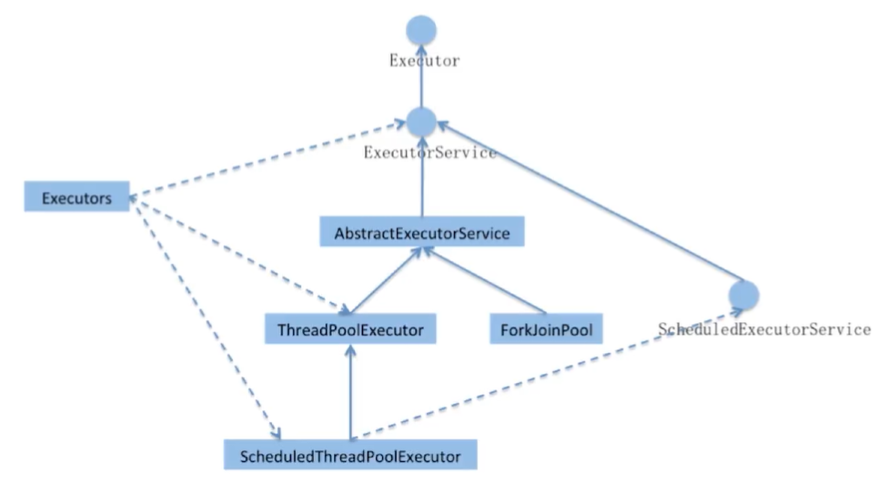
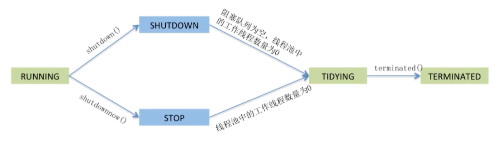
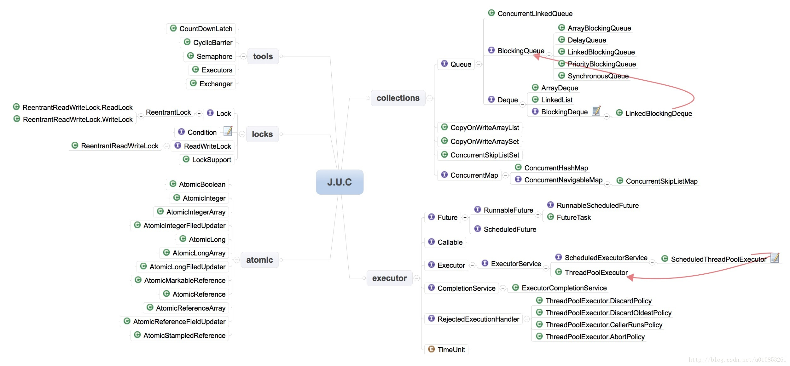

# Offer 直通车——多线程与并发

* 进程和线程的由来

  串行

  批处理

  进程：进程独占内存空间，保存各自运行状态，相互间不干扰且可以互相切换，为并发处理任务提供了可能

  线程：线程共享进程的内存资源，相互间切换更快速，支持更细粒度的任务控制，使进程内的子任务得以并发执行

* 进程和线程的区别

  进程是资源分配的最小单位，线程是 CPU 调度的最小单位

  线程不能被看做独立应用，而进程可以被看做独立应用

  进程有独立的地址空间，相互不影响，线程只是进程的不同执行路径（线程挂掉后，它所在的进程也会挂掉）

  线程没有独立的地址空间，多进程的程序比多线程程序健壮

  进程的切换比线程的切换开销大

* Java 中进程和线程的关系

  Java 对操作系统提供的功能进行封装，包括进程和线程

  运行一个程序会产生一个进程，进程包含至少一个线程

  每个进程对应一个 JVM 实例，多个线程共享 JVM 里的堆内存

  Java 采用单线程编程模型，自动创建主线程

  主线程可以创建子线程，原则上要后于子线程完成执行

* 线程的 start 和 run 方法的区别

  调用 start() 方法会创建一个子线程并启动（native void start0() -> native void registerNatives() -> JVM_StartThread -> new JavaThread(&thread_entry, sz) -> run）

  ```java
  private native void start0();
  
  /* Make sure registerNatives is the first thing <clinit> does. */
  private static native void registerNatives();
  static {
      registerNatives();
  }
  
  Thread.c
  Java_Java_lang_Thread_registerNatives (JNIEnv *env, jclass cls){ //registerNatives
      (*env)->RegisterNatives(env, cls, methods, ARRAY_LENGTH(methods));
  }
  static JNINativeMethod methods[] = {
      {"start0",           "()V",        (void *)&JVM_StartThread}, //start0 方法
      ...
  }
  
  JVM_ENTRY(void, JVM_StartThread(JNIEnv* env, jobject jthread)){
      ...
      native_thread = new JavaThread(&thread_entry, sz);
      ...
  }
  
  static void thread_entry(JavaThread* thread, TRAPS) {
      HandleMark hm(THREAD);
      Handle obj(THREAD, thread->threadObj());
      JavaValue result(T_VOID);
      JavaCalls::call_virtual(&result,obj,
      KlassHandle(THREAD,SystemDictionary::Thread_klass()),
      vmSymbolHandles::run_method_name(), //this
      vmSymbolHandles::void_method_signature(),THREAD);
  }
  
  class vmSymbolHandles: AllStatic {
      ...
      template(run_method_name,"run")
      ...
  }
  ```

  run() 方法只是 Thread 的一个普通方法的调用

* Thread 和 Runnable 关系

  Thread implements Runnable

  因类的单一继承原则，推荐使用 Runnable 接口

* 如何给 run() 方法传参

  构造函数传参；成员变量传参；回调函数传参

* 如何获取线程的返回值

  主线程等待；Thread.sleep(millis);

  使用 Thread 类的 join() 阻塞当前线程以等待子线程处理完毕；thread.join();

  通过 Callable 接口实现，FutureTask 或线程池（Future）

  ```java
  FutureTask<String> task = new FutureTask<String>(new MyCallable());
  new Thread(task).start();
  task.get();
  
  ExecutorService executorService = Executors.newCachedThreadPool();
  Future<String> future = executorService.submit(new MyCallable());
  future.get();
  ```

* Java 线程状态（java.lang.Thread.State）及转换

  

  **新建（New）**：创建后尚未启动的（start()）线程的状态（A thread that has not yet started is in this state）

  **运行（Runnable）**：包含 Running 和 Ready（A thread executing in the Java virtual machine is in this state）

  **无限期等待（Waiting）**：需要显式被唤醒（没有设置 timeout 参数的 Object.wait() 方法；没有设置 timeout 参数的 Thread.join() 方法；LockSupport.park() 方法）（A thread that is waiting indefinitely for another thread to perform a particular action is in this state）

  **限期等待（Timed Waiting）**：在一定时间后会由系统自动唤醒（Thread.sleep()；设置 timeout 参数的 Object.wait() 方法；设置 timeout 参数的 Thread.join() 方法；LockSupport.parkNanos() 方法；LockSupport.parkUntil() 方法）（A thread that is waiting for another thread to perform an action for up to a specified waiting time is in this state）

  **阻塞（Blocked）**：等待获取排它锁（Lock；synchronized）（A thread that is blocked waiting for a monitor lock is in this state）

  **结束（Terminated）**：已终止线程的状态，线程已经结束执行，不能再调用 start()（A thread that has exited is in this state）

* sleep 和 wait 的区别

  sleep 是 Thread 类的方法，wait 是 Object 类的方法

  sleep 方法可以在任何地方使用，而 wait 方法只能在 synchronized 方法或 synchronized 代码块中使用

  Thread.sleep 只会让出 CPU，不会导致锁行为的改变；Object.wait 不仅让出 CPU，还会释放已经占有的同步资源锁

* notify，notifyAll 和 yield

  

  在 Java 中，每个对象都有两个池，锁池和等待池

  锁池 EntryList：假设线程 A 已经拥有了某个对象（不是类）的锁，而其他线程 B、C 想要调用这个对象的某个 synchronized 方法（或者代码块），由于 B、C 线程在进入对象的 synchronized 方法（或者代码块）之前必须先获得该对象的锁，而恰巧该对象的锁目前正被线程 A 所占用，此时 B、C 线程就会被阻塞，进入一个地方去等待锁的释放，这个地方便是该对象的锁池。被 notify、notifyAll 唤醒的线程进入到该对象的锁池

  等待池 WaitSet：假设线程 A 调用了某个对象的 wait() 方法，线程 A 释放该对象的锁，同时线程 A 就进入到了该对象的等待池中，进入到等待池中的线程不会去竞争该对象的锁

  notify 和 notifyAll：notifyAll 会让所有处于等待池的线程全部进入锁池去竞争获取锁的机会，notify 只会随机选取一个处于等待池中的线程进入锁池去竞争获取锁的机会

  yield：当调用 Thread.yield() 函数时，会给线程调度器一个当前线程愿意让出 CPU 使用的暗示，但是线程调度器可能会忽视这个暗示，不会导致锁行为的改变

* 如何中断线程

  * stop

    破坏逻辑完整性；破坏原子逻辑

    清理工作无法完成；会立刻释放锁，可能会引发数据不同步的问题

    ```java
    @Override
    public void run() {
        synchronized (this) {
            ++x;
            try {
                Thread.sleep(5000);
            } catch (InterruptedException e) {
                e.printStackTrace();
            }
            ++y;
        }
    }
    ```

  * suspend 和 resume（废弃）

  * interrupt

    isInterrupted()；interrupt()；interrupted()

    | thread.interrupt();                            | thread.isInterrupted(); | thread.getState(); |
    | ---------------------------------------------- | ----------------------- | ------------------ |
    | New / Terminated                               | false                   | New / Terminated   |
    | Runnable                                       | true                    | Runnable           |
    | Blocked                                        | true                    | Blocked            |
    | Waiting / Timed Waiting & InterruptedException | false                   |                    |

    通知线程应该要中断了

    如果线程处于 Waiting / Timed Waiting 状态，那么线程将抛出一个 InterruptedException 异常，中断标志位重置为 false

    如果线程处于正常活动状态（Runnable、Blocked），那么会将该线程的中断标志设置为 true，被设置中断标志的线程将继续正常执行，不受影响

    需要被调用的线程配合中断：在正常运行任务时，经常检查本线程的中断标志位（Thread.currentThread().isInterrupted()），如果被设置了中断标志就自行停止线程；catch InterruptedException

* 线程安全问题

  * 线程安全问题的主要原因

    存在共享数据（也称临界资源）

    存在多线程共同操作这些共享数据

  * 解决问题的根本方法

    同一时刻有且只有一个线程在操作共享数据，其他线程必须等到该线程处理完共享数据后再对共享数据进行操作

* 互斥锁的特性

  互斥性：即在同一时间只允许一个线程持有某个对象锁，通过这种特性来实现多线程的协调机制，这样在同一时间只有一个线程对需要同步的代码块进行访问。互斥性也称为操作的原子性

  可见性：必须确保在锁被释放之前，对共享变量所做的修改，对于随后获得该锁的另一个线程是可见的（即在获得锁时应获得最新共享变量的值）

* synchronized 对象锁和类锁

  * 对象锁

    同步代码块，锁是 () 中的实例对象：synchronized(this)，synchronized(类实例对象)

    同步非静态方法，锁是当前对象的实例对象：synchronized method

  * 类锁

    同步代码块，锁是 () 中的类对象：synchronized(类.class)

    同步静态方法，锁是当前对象的类对象：synchronized static method

  * 总结

    有线程访问对象的同步代码块时，另外的线程可以访问该对象的非同步代码块

    若锁住的是同一个对象，一个线程在访问对象的同步方法（代码块）时，另一个访问对象的同步方法（代码块）的线程会被阻塞

    若锁住的是同一个对象，一个线程在访问对象的同步方法时，另一个访问对象的代码块的线程会被阻塞，反之亦然

    同一个类的不同对象的对象锁互不干扰

    类锁由于也是一种特殊的对象锁，因此表现和上述一致，而由于一个类只有一把对象锁，所以同一个类的不同对象使用类锁将会是同步的

    类锁和对象锁互不干扰

* synchronized 底层实现原理

  synchronized 代码块（字节码）：monitorenter；monitorexit

  synchronized 方法（字节码）：ACC_SYNCHRONIZED

  Monitor 的本质是依赖于底层操作系统的 Mutex Lock 实现，操作系统实现线程之间的切换需要从用户态到内核态的转换，成本非常高

  * Java 对象头

    

    HotSpot 虚拟机中，对象在内存中存储的布局可以分为三块区域：对象头（Header）、实例数据（Instance Data）和对齐填充（Padding）

    Mark Word（非固定的数据结构，会随着对象的不同状态而变化）：默认存储对象的 hashcode，分代年龄 age，锁类型（是否是偏向锁），锁标志位等（指向栈中锁记录的指针，指向重量级锁的指针，线程 ID，Epoch）信息

    Class Metadata Address：类型指针指向对象的类元数据，JVM 通过这个指针确定该对象是哪个类的实例

  * Monitor（hotspot - ObjectMonitor.hpp 实现 Monitor）

    

    每个 Java 对象天生自带了一把看不见的锁（内部锁或 Monitor 锁） -> Java 中任意对象可以作为锁的原因

    源码：\_count、\_owner、\_WaitSet、\_EntryList

    可以理解为一种同步工具，也可理解为一种同步机制，常常被描述为一个 Java 对象

    互斥：一个 Monitor 在一个时刻只能被一个线程持有，即 Monitor 中的所有方法都是互斥的

    signal 机制：如果条件变量不满足，允许一个正在持有 Monitor 的线程暂时释放持有权，当条件变量满足时，当前线程可以唤醒正在等待该条件变量的线程，然后重新获取 Monitor 的持有权

* 重入

  从互斥锁的设计上来说，当一个线程试图操作一个由其他线程持有的对象锁的临界资源时，将会处于阻塞状态，但当一个线程再次请求自己持有的对象锁的临界资源时，这种情况属于重入

* 为什么会对 synchronized 嗤之以鼻

  早期版本中，synchronized 属于重量级锁，依赖于 Mutex Lock 实现，线程之间的切换需要从用户态转换到内核态，开销较大

  java 6 以后，synchronized 性能得到了很大的提升（**Adaptive Spinning、Lock Eliminate、Lock Coarsening、Lightweight Locking、Biased Locking**）

  * 自旋锁

    许多情况下，共享数据的锁定状态持续时间较短，切换线程不值得（线程上下文切换），通过让线程执行忙循环等待锁的释放，不让出 CPU

    若锁被其他线程长时间占用，会带来许多性能上的开销（自旋次数 PreBlockSpin）

  * 自适应自旋锁

    自旋的次数不再固定，由前一次在同一个锁上的自旋时间以及锁的拥有者的状态来决定

    如果在同一个锁对象上，自旋等待刚刚成功获得过锁，并且持有锁的线程正在运行中，那么虚拟机就会认为这次自旋也是很有可能再次成功，进而它将允许自旋等待持续相对更长的时间。如果对于某个锁，自旋很少成功获得过，那么以后尝试获取这个锁时将可能省略掉自旋过程，直接阻塞线程，避免浪费处理器资源

  * 锁消除

    更彻底的优化，JIT 编译时，对运行上下文进行扫描，去除不可能存在竞争的锁

    StringBuffer sb = new StringBuffer();

    sb.append("s").append("b");

  * 锁粗化

    通过扩大加锁的范围，避免反复加锁和解锁

* synchronized 锁的四种状态

  无锁、偏向锁、轻量级锁、重量级锁

  |    锁    |                             优点                             |                             缺点                             |                     使用场景                     |
  | :------: | :----------------------------------------------------------: | :----------------------------------------------------------: | :----------------------------------------------: |
  |  偏向锁  | 加锁和解锁不需要 CAS 操作，没有额外的性能消耗，和执行非同步方法相比仅存在纳秒级的差距 | 如果线程间存在锁竞争，会带来额外的锁撤销的消耗（置换 Thread ID 时依赖 CAS） |        只有一个线程访问同步块或者同步方法        |
  | 轻量级锁 |              竞争的线程不会阻塞，提高了响应速度              |          若线程长时间抢不到锁，自旋会消耗 CPU 性能           |          线程交替执行同步块或者同步方法          |
  | 重量级锁 |               线程竞争不使用自旋，不会消耗 CPU               | 线程阻塞，响应时间缓慢，在多线程下频繁地获取和释放锁，会带来巨大的性能开销 | 追求吞吐量，同步块或者同步方法执行时间较长的场景 |

  * 偏向锁（在没有多线程竞争的情况下，减少轻量级锁的不必要的 CAS 操作）

    减少同一线程获取锁的代价（大多数情况下，锁不存在多线程竞争，总是由同一线程多次获得）

    如果一个线程获得了锁，那么锁就进入偏向模式，此时 Mark Word 的结构也变为偏向锁结构，当该线程再次请求锁时，无需再做任何同步操作，即获取锁的过程只需要检查 Mark Word 的锁标记位为偏向锁以及当前线程 id 等于 Mark Word 的 ThreadID 即可，这样就省去了大量有关锁申请的操作

    不适用于锁竞争比较激烈的多线程场合

  * 轻量级锁（在没有多线程竞争的情况下，通过 CAS 减少重量级锁使用操作系统互斥量产生的性能消耗）

    轻量级锁是由偏向锁升级来的，偏向锁运行在一个线程进入同步块的情况下，当第二个线程加入锁争用的时候，偏向锁就会升级为轻量级锁

    适用于线程交替执行同步块

    若存在同一时间多线程访问同一个锁的情况，就会导致轻量级锁膨胀为重量级锁

* 轻量级锁的加锁过程

  在线程进入同步块的时候，如果同步对象锁状态为无锁状态（锁标志位为 01），虚拟机首先在当前线程的栈帧中建立一个名为锁记录（Lock Record）的空间，用于存储对象目前的 Mark Word 的拷贝（Displaced Mark Word）。

  拷贝对象头中的 Mark Word 到 Lock Record。

  拷贝成功后，虚拟机将使用 CAS 操作尝试将对象的 Mark Word 更新为指向 Lock Record 的指针，并将 Lock Record 里的 owner 指针指向对象的 Mark Word。

  如果这个更新操作成功了，那么这个线程就拥有了该对象的锁，并且将对象的 Mark Word 的锁标志位设置为 00，即表示此对象处于轻量级锁定状态。如果这个更新操作失败了，虚拟机首先会检查对象的 Mark Word 是否指向当前线程的栈帧，如果是就说明当前线程已经拥有了这个对象的锁，那就可以直接进入同步块继续执行。否则当前线程尝试使用自旋来获取锁，直到获取到锁或自旋结束。如果自旋期间获取到锁，执行同步块，否则说明多个线程竞争锁，轻量级锁就要膨胀为重量级锁，锁标记的状态值变为 10，Mark Word 中存储的就是指向重量级锁（互斥量）的指针，当前线程及后面等待锁的线程要进入阻塞状态。

* 轻量级锁的解锁过程

  通过 CAS 操作尝试把线程中复制的 Displaced Mark Word 对象替换当前的 Mark Word，如果替换成功，整个同步过程就完成了，将锁标志位置为 01 无锁状态。如果替换失败，说明有其他线程尝试获取该锁（此时锁已膨胀），那就要在释放锁的同时，唤醒被挂起的线程。

* 锁的内存语义

  当线程释放锁时，Java 内存模型会把该线程对应的本地内存中的共享变量刷新到主内存中；而当线程获取锁时，Java 内存模型会把该线程对应的本地内存置为无效，从而使得被监视器保护的临界区代码必须从主内存中读取共享变量。

* synchronized 和 ReentrantLock

  * ReentrantLock

    位于 java.util.concurrent.locks 包

    和 CountDownLatch、FutureTask、Semaphore 一样基于 AQS 实现

    能够实现比 synchronized 更细粒度的控制，如控制 fairness

    调用 lock() 之后，必须调用 unlock() 释放锁

    性能未必比 synchronized 高，并且也是可重入的

  * ReentrantLock 公平性设置

    // 倾向于将锁赋予等待时间最久的线程

    ReentrantLock fairnessLock = new ReentrantLock(true);

    公平锁：获取锁的顺序按先后调用 lock 方法的顺序（慎用）

    非公平锁：抢占的顺序不一定

    synchronized 是非公平锁

  * ReentrantLock 将锁对象化

    * 判断是否有线程（或者某个特定的线程）在排队等待获取锁

      protected Collection\<Thread\> getQueueThreads()

      boolean hasQueuedThread(Thread thread)

    * 带超时的获取锁的尝试

      boolean tryLock(long timeout, TimeUnit unit)

    * 感知有没有成功获取锁

      boolean isHeldByCurrentThread()

  * 将 wait、notify、notifyAll 对象化

    java.util.concurrent.locks.Condition / ArrayBlockingQueue（由数组实现的线程安全的有界阻塞队列）

    ReentrantLock lock = new ReentrantLock();

    Condition condition = lock.newCondition();

    condition.await(); / condition.signal(); / condition.signalAll();

    整个协作过程是靠节点在 AQS 等待队列和 Condition 等待队列中来回移动实现的：

    线程 A 调用 lock.lock() 时，线程被加入到 AQS 等待队列中

    线程 A 调用 condition.await()，该线程从 AQS 等待队列中移除，对应操作是锁的释放

    接着线程 A 马上被加入到 Condition 等待队列中，意味着该线程需要 signal 信号

    线程 B 因为线程 A 释放锁被唤醒，并判断可以获取锁，于是线程 B 获取锁，并被加入到 AQS 等待队列中

    线程 B 调用 condition.signal()，此时 Condition 等待队列中只有线程 A 一个节点，于是它被取出来，并被加入到 AQS 等待队列中。注意，这个时候，线程 A 并没有被唤醒

    signal 方法执行完毕，线程 B 调用 lock.unLock() 释放锁。这个时候因为 AQS 等待队列中只有线程 A，于是 AQS 按照从头到尾的顺序唤醒线程时，线程 A 被唤醒，于是线程 A 恢复执行

  * 总结

    synchronized 是关键字，ReentrantLock 是类

    ReentrantLock 可以对获取锁的等待时间进行设置，避免死锁

    synchronized 操作 Mark Word，ReentrantLock 调用 Unsafe 类的 park() 方法

* 并发涉及到两大核心、三大性质

  两大核心：JMM（线程之间如何通信，共享内存的并发模型）、Happens-Before 原则（对重排序规则以及具体实现做了封装）

  三大性质：原子性、可见性、有序性

* JMM

  

  * JMM 概述（Java 采用共享内存并发模型实现线程间通信）

    The Java Memory Model defines how threads interact through memory.

    Java 内存模型规定 Java 中所有的变量（成员变量，类信息，常量，静态变量等线程共享的变量，不包括局部变量等私有的变量）均存放于主内存中，每个线程则有各自的工作内存，工作内存中的变量是主内存的副本，线程只能对工作内存中的变量进行直接操作，并且线程之间不能互相访问对方的工作内存，只能依靠主内存进行通信。

  * JMM 中的主内存

    存储 Java 实例对象，包括成员变量、类信息、常量、静态变量等

    属于数据共享的区域，多线程并发操作时会引发线程安全问题

  * JMM 中的工作（本地）内存

    存储当前方法的所有本地变量信息（主内存中变量副本的拷贝），本地变量对其他线程不可见

    字节码行号指示器、Native 方法信息

    属于线程私有数据区域，不存在线程安全问题

  * JVM 对 JMM 的实现

    基本数据类型的本地变量将直接存储在工作内存的栈帧结构中

    引用类型的本地变量，引用存储在工作内存中，实例存储在主内存中

    成员变量、静态变量、类信息均会被存储在主内存中

    主内存共享的方式是线程各拷贝一份数据到工作内存，操作完成后刷新回主内存

  * JMM 带来的问题

    可见性问题（所谓不可见，是指一个线程对共享变量的修改不能及时地被其他线程看到）；竞争现象

* 指令重排

  * 指令重排序类型

    编译器优化的重排序（as-if-serial）；指令级并行的重排序（数据依赖性）；内存系统的重排序（缓存）

  * 指令重排序需要满足的条件

    （as-if-serial）在单线程环境下不能改变程序运行的结果

    （数据依赖性）存在数据依赖关系的不允许重排序（但是不同处理器及不同线程之间的数据依赖性不被编译器和处理器考虑）。写后读（a = 1; b = a;），写后写（a = 1; a = 2;），读后写（a = b; b = 1;）

    （控制依赖性）if()

  * 并发下重排序带来的问题（可见性）及解决

    ```java
    int a = 0;
    boolean flag = false;
    public void init() {
        a = 1; // 1
        flag = true; // 2
    }
    public void use() {
        if (flag) { // 3
            int i = a * a; // 4
        }
    }
    ```

    A 线程首先执行 init() 方法，随后 B 线程执行 use() 方法：A(2) -> B(3) -> B(4) -> A(1)

    内存屏障；临界区（synchronized）

* JMM 阐述内存可见性

  as-if-serial 语义保证单线程内程序的执行结果不被改变，happens-before 关系保证正确同步的多线程程序的执行结果不被改变

* Happens-Before

  * happens-before 阐述

    JMM 可以通过 happens-before 关系向程序员提供跨线程的内存可见性保证（如果 A 线程的写操作 a 与 B 线程的读操作 b 之间存在 happens-before 关系，尽管 a 操作和 b 操作在不同的线程中执行，但 JMM 向程序员保证 a 操作将对 b 操作可见）

    如果两个操作不满足下述任意一个规则，那么这两个操作就没有顺序的保障，JVM 可以对这两个操作进行重排序

    如果操作 A happens-before 操作 B，那么操作 A 在内存上所做的操作对操作 B 都是可见的，而且操作 A 的执行顺序排在操作 B 之前

    两个操作之间存在 happens-before 关系，并不意味着 Java 平台的具体实现必须按照 happens-before 关系指定的顺序来执行

  * happens-before 的八大原则

    程序次序规则：一个线程内，按照代码顺序，书写在前面的操作先行发生于书写在后面的操作（单线程内，程序书写顺序执行的结果和最终执行的结果是一致的，虽然存在指令重排序）

    锁定规则：一个 unLock 操作先行发生于后面对同一个锁的 lock 操作

    volatile 变量规则：对一个变量的写操作先行发生于后面对这个变量的读操作

    传递规则：如果操作 A 先行发生于操作 B，而操作 B 又先行发生于操作 C，则可以得出操作 A 先行发生于操作 C

    线程启动规则：Thread 对象的 start() 方法先行发生于此线程的每一个动作

    线程中断规则：对线程 interrupt() 方法的调用先行发生于被中断线程的代码检测到中断事件的发生

    线程终结规则：线程中所有的操作都先行发生于线程的终止检测

    对象终结规则：一个对象的初始化的完成先行发生于它的 finalize() 方法的开始

* volatile

  * volatile 特性

    （可见性、有序性）禁止指令重排序，保证被 volatile 修饰的共享变量对所有线程总是可见的

    （原子性；线程不安全）只能保证对单次读、写的原子性，i++ 不能保证原子性

  * volatile 内存语义

    当写一个 volatile 变量时，JMM 会把该线程对应的工作内存中的共享变量值刷新到主内存中

    当读取一个 volatile 变量时，JMM 会把该线程对应的工作内存置为无效，只能从主内存中读取共享变量

  * volatile 内存语义的实现

    * 内存屏障（Memory Barrier）：保证特定操作的执行顺序；保证某些变量的内存可见性

      通过插入内存屏障指令禁止在内存屏障前后的指令执行重排序优化

      强制刷出各种 CPU 的缓存数据，因此任何 CPU 上的线程都能读取到这些数据的最新版本

    * 基于保守策略的 JMM 内存屏障插入策略

      在每个 volatile 写操作的前面插入一个 StoreStore 屏障（禁止前面的写与 volatile 写重排序）

      在每个 volatile 写操作的后面插入一个 StoreLoad 屏障（禁止 volatile 写与后面可能有的读和写重排序）

      在每个 volatile 读操作的后面插入一个 LoadLoad 屏障（禁止 volatile 读与后面的读操作重排序）

      在每个 volatile 读操作的后面插入一个 LoadStore 屏障（禁止 volatile 读与后面的写操作重排序）

      其中重点说下 StoreLaod 屏障，它是确保可见性的关键，因为它会将屏障之前的写缓冲区中的数据全部刷新到主内存中

  * 双重检查单例模式

    instance = new Singleton(); 可以分为以下三个步骤：

    memory = allocate(); // 分配对象内存空间

    instance(memory); // 初始化对象

    instance = memory; // 设置 instance 指向刚分配的内存地址，此时 instance != null

    可能发生指令重排序，因为单线程语义一致：

    memory = allocate(); // 分配对象内存空间

    instance = memory; // 设置 instance 指向刚分配的内存地址，此时 instance != null，但是对象还没有初始化完成

    instance(memory); // 初始化对象

  * volatile 和 synchronized

    volatile 的本质是告诉 JVM 当前变量在工作内存中的值是不确定的，需要从主存中读取；synchronized 则是锁定当前变量，只有当前线程可以访问该变量，其他线程被阻塞住直到该线程完成变量操作为止

    volatile 仅能使用在变量级别；synchronized 则可以使用在变量、方法和类级别

    volatile 仅能实现变量的修改可见性，不能保证原子性；而 synchronized 则可以保证变量修改的可见性和原子性

    volatile 不会造成线程的阻塞；synchronized 可能会造成线程的阻塞

    volatile 标记的变量不会被编译器优化；synchronized 标记的变量可以被编译器优化

* CAS（Compare and Swap）

  * 一种高效实现线程安全性的方法

    支持原子更新操作，适用于计数器，序列发生器等场景（AtomicInteger）

    属于乐观锁机制，号称 lock-free

    CAS 操作失败时由开发者决定是继续尝试，还是执行别的操作

    CAS 操作是一条 CPU 的原子指令，所以不会有线程安全问题

  * CAS 思想

    包含三个操作数，内存位置（V），预期原值（A）和新值（B）

    i++ > getfield, iadd, putfield

  * CAS 多数情况下对开发者来说是透明的

    J.U.C 封装

    Unsafe 类虽提供 CAS 服务，但因能够操纵任意内存地址读写而有隐患，Java 9 之后，可以使用 Variable Handle API 来替代 Unsafe

  * 缺点

    若循环时间长，则开销很大（操作失败的线程将会再次发起操作，而不是被 OS 挂起）

    只能保证一个共享变量的原子操作

    ABA 问题 -> AtomicStampedReference（带有时间戳的原子操作类；除了更新数据本身外，还必须要更新时间戳）

* Java 线程池

  * 利用 Executors 创建不同的线程池满足不同场景的需求

    newFixedThreadPool

    newCachedThreadPool

    newSingleThreadExecutor

    newSingleThreadScheduledExecutor 和 newScheduledThreadPool

    newWorkStealingPool：内部会构建 ForkJoinPool，利用 working-stealing 算法（某个线程从其他队列里窃取任务来执行；双端队列），并行地处理任务，不保证处理顺序

  * Fork/Join 框架

    把大任务分割成若干个小任务并行执行，最终汇总每个小任务的结果后得到大任务结果

  * 为什么要使用线程池

    降低资源消耗；提高线程的可管理性

  * J.U.C 的三个 Executor 接口

    

    Executor：运行新任务的简单接口，将任务提交和任务执行细节解耦

    ExecutorService：具备管理执行器和任务生命周期的方法，提交任务机制更完善，\<T\> Future\<T\> submit(Callable\<T\> task)

    ScheduledExecutorService：支持 Future 和定期执行任务

  * ThreadPoolExecutor

    public ThreadPoolExecutor(int corePoolSize,
                              int maximumPoolSize,
                              long keepAliveTime,
                              TimeUnit unit,
                              BlockingQueue\<Runnable\> workQueue,
                              ThreadFactory threadFactory,
                              RejectedExecutionHandler handler)

    handler：

    AbortPolicy：直接抛出异常（RejectedExecutionException），这是默认策略

    CallerRunsPolicy：用调用者所在的线程来执行任务

    DiscardOldestPolicy：丢弃队列中最靠前的任务，并执行当前任务

    DiscardPolicy：直接丢弃任务

    实现 RejectedExecutionHandler 接口的自定义 handler

  * execute 执行

    如果运行的线程少于 corePoolSize，则创建新线程来处理任务，即使线程池中的其他线程是空闲的

    如果线程池中的线程数量大于等于 corePoolSize 且小于 maximumPoolSize，则只有当 workQueue 满时才创建新的线程去处理任务

    如果设置的 corePoolSize 和 maximumPoolSize 相同，则创建的线程池的大小是固定的，这时如果有新任务提交，若 workQueue 未满，则将请求放入 workQueue 中，等待有空闲的线程去从 workQueue 中取任务并处理

    如果运行的线程数量大于等于 maximumPoolSize，这时如果 workQueue 已经满了，则通过 handler 所指定的策略来处理任务

  * 线程池的状态（AtomicInteger ctl）

    

    RUNNING：能接受新提交的任务，并且也能处理阻塞队列中的任务

    SHUTDOWN：不再接受新提交的任务，但可以处理存量任务

    STOP：不再接受新提交的任务，也不处理存量任务

    TIDYING：所有的任务都已终止

    TERMINATED：terminated() 方法执行完后进入该状态

  * 线程池的大小如何选定

    CPU 密集型：线程数 = CPU 核数

    IO 密集型：线程数 = CPU 核数 * （1 + 平均等待时间 / 平均工作时间）

* J.U.C

  