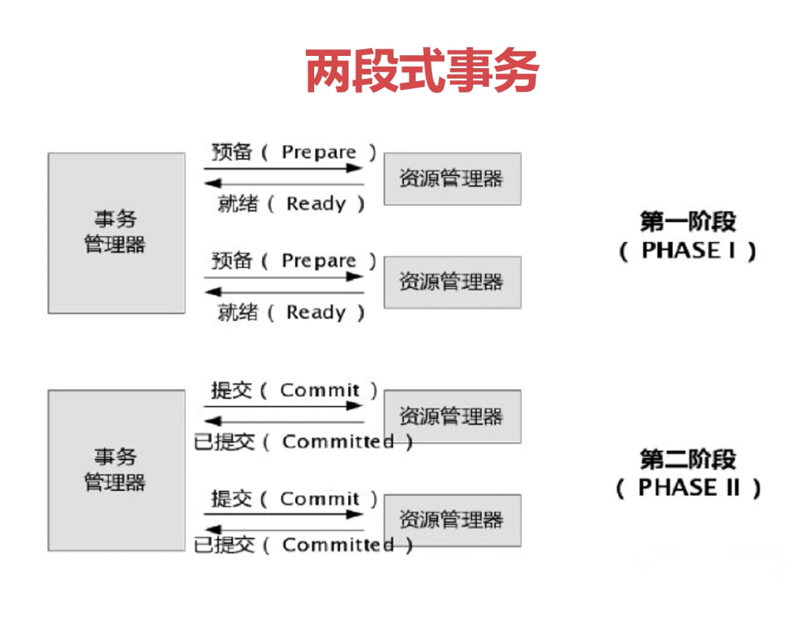
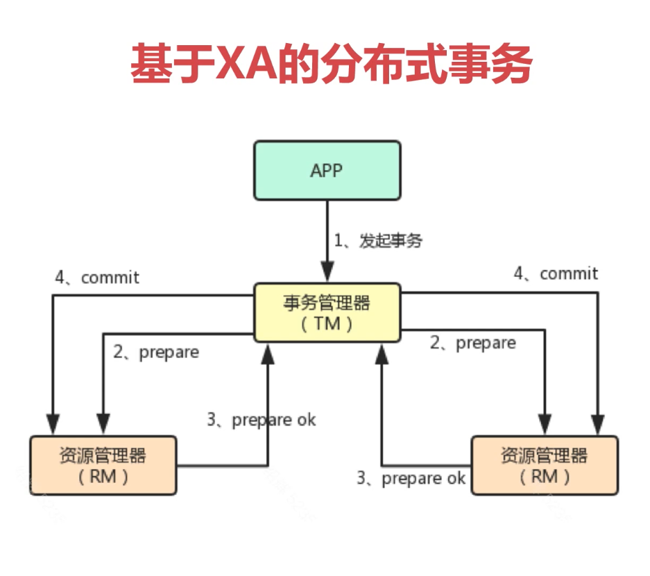
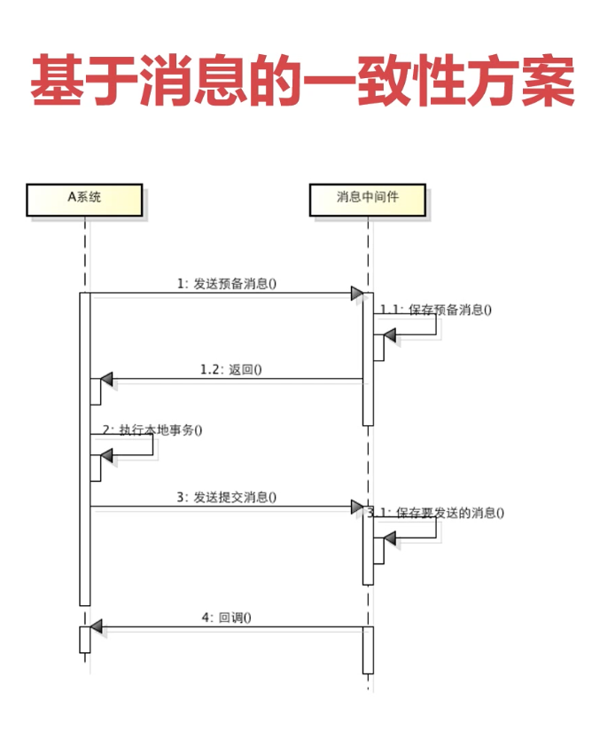
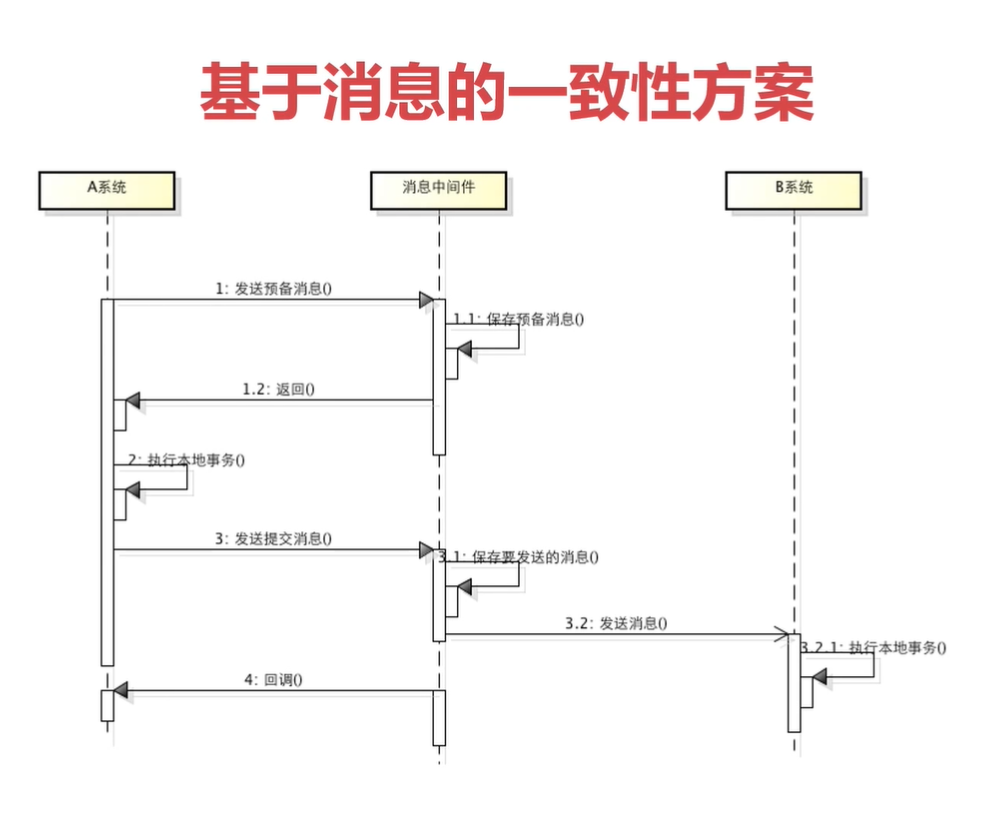
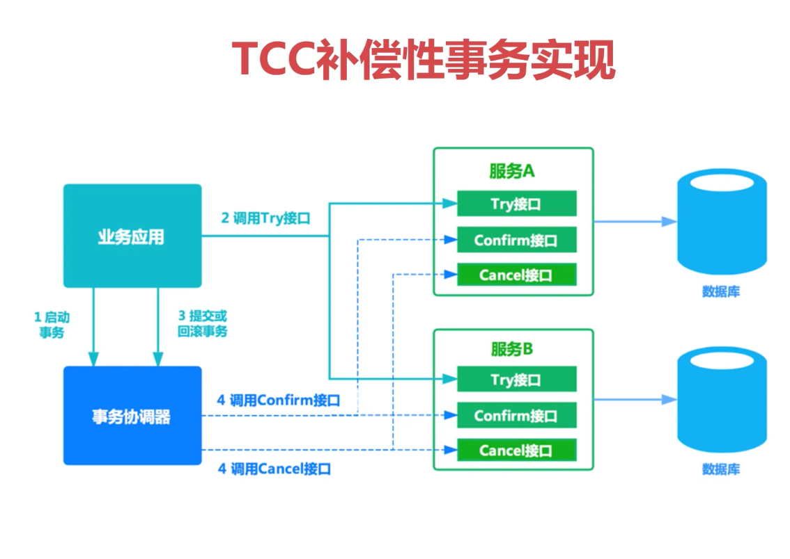

# 分布式事务

* 事务

  * 介绍

    * 事务是用来保证一组**数据操作**的完整性和一致性

    * 事务必须满足 ACID 的四大特性

      原子性、一致性、隔离性、持久性

    * 事务具有四种隔离级别

    * 事务具有七种传播行为

* 分布式事务

  * 概念

    分布式事务就是将多个节点的事务看成一个整体处理

    分布式事务由事务参与者、资源服务器、事务管理器等组成

    常见的分布式事务的例子：支付、下订单等

  * 实现思路

    * 两段式事务（2PC）和三段式事务（3PC）

      

    * 基于 XA 的分布式事务

      

    * 基于消息的一致性方案（强一致性）

      

      

    * TCC 补偿性事务

      
  
  * 基于消息的一致性方案和 TCC 补偿性事务比较

    基于消息事务是强一致性事务，会存在资源浪费（等待）和服务雪崩

    TCC 事务是柔性事务，在 try 阶段要对资源做预留，在确认或取消阶段释放资源，时效性更好

  * 分布式事务框架
  
    * GTS
  * DTX
    * [TCC](https://github.com/changmingxie/tcc-transaction)

  * TCC 解读
  
  子事务：
  
  * 在需要提供分布式事务支持的接口上添加 @Compensable
    * 在对应的接口实现上添加 @Compensable(confirmMethod, cancelMethod, transactionContextEditor)
    * 在同一个类中实现 confirmMethod 和 cancelMethod

    主事务：

    * @Compensable(confirmMethod, cancelMethod, asyncConfirm = true)
    * 调用子事务
  
    注意：
  
    * 在分布式事务里，不要轻易在业务层捕获所有异常
    * 在使用 TCC 时，confirm 和 cancel 的幂等性需要自己代码支持
  
  * 幂等性
  
    使用相同参数对同一资源重复调用某个接口的结果与调用一次的结果相同
