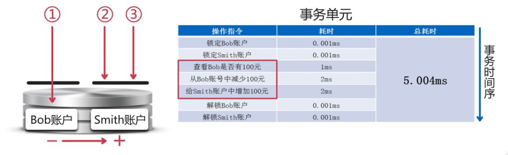
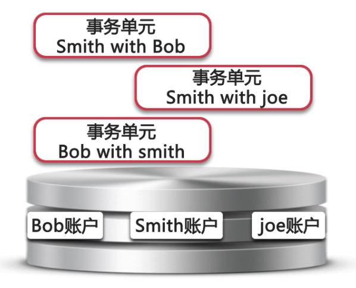
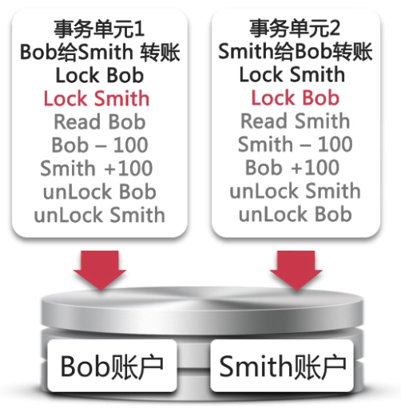
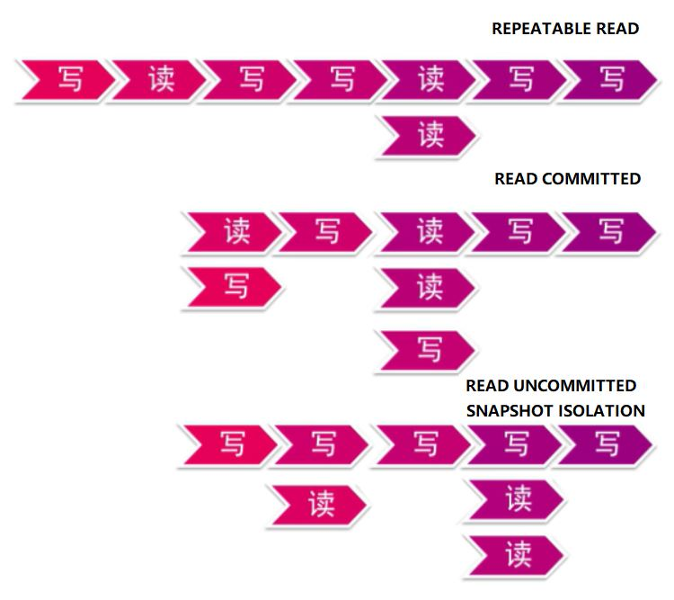
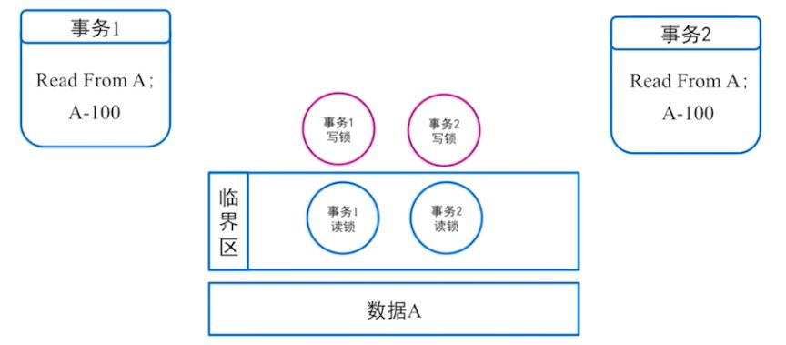
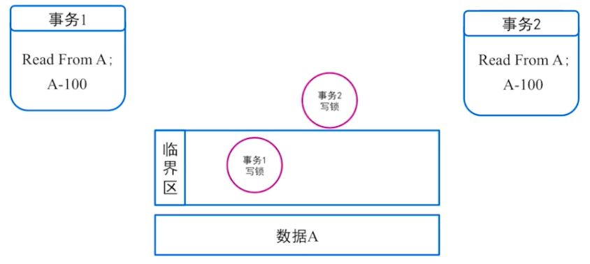

# 在线分布式数据库原理与实践

* 事务简介

  * 核心：锁、并发

  * 单个事务单元

    

    ACID 保证事务完整性

    这些也是一个事务单元：

    建立一个索引

    从数据库中读取一行记录

    向数据库中写入一行记录，同时更新这行记录的所有索引

    删除整张表

    （所有对数据库的一个操作，都可以认为是一个事务）

  * 一组事务单元

    

    * 事务单元之间的 happen-before 关系

      读写、写读、读读、写写

      速度 && 逻辑顺序

    * 排队法（序列化读写）

      

      对应事务隔离级别 SERIALIZABLE

      优势：不需要冲突控制

      劣势：慢速设备

    * 排他锁（针对同一个单元的访问进行控制）

      

    * 读写锁（针对**读读场景**可以做优化）

      

      对应事务隔离级别 REPEATABLE READ

      读不加锁（针对**读写场景**的优化）

      对应事务隔离级别 READ COMMITTED

      （可以看出，隔离性是对一致性的破坏，基于对性能的追求）

    * MVCC（能够做到写不阻塞读，**写读场景**的优化）

      
      
      本质来说是 copy on write

* 事务处理常见的问题

  * 多个事务，谁先谁后（MVCC 下，一个读请求应该读哪一个写之后的数据）

    逻辑时间戳：SCN（Oracle）、Trx_id（Innodb）

    通过逻辑时间戳保证事务单元之间的 happen before

  * 如何故障恢复

    业务属性不匹配（原子性，回滚）

    系统崩溃（recovery 状态，系统对外部不暴露监听）

  * 碰到死锁了怎么办

    * 死锁产生的原因（哲学家问题）

      

      两个线程、不同方向、相同资源

    * 死锁的解决方案

      尽可能不死锁（降低事务隔离级别）
    
      碰撞检测（记录事务单元维持的锁和等待的锁，发现碰撞后终止一边）
      
      等锁超时

* 深入单机事务

  * 事务的 ACID

    * 原子性

      一个事务要么同时成功，要么同时失败（保证记录 undo 日志，回滚到之前的版本）

      version 1：Bob 100，Smith 0

      version 2：Bob 0，Smith 0 -> 另外一个事务更新为 300，此时回滚后 Smith 变为 0

      version 3：Bob 0，Smith 100

    * 一致性

      Can（happen before）

      针对原子性中出现的问题，通过加锁保证强一致性，lock Bob and Smith

      如何处理不同事务间读写并行，是一致性中最重要的部分

      事务间保证 happen before，保证能看到系统内的所有更改（保证一个事务单元全部成功后才可见）

    * 隔离性（SQL 92）

      以性能为理由，对一致性（排队）的破坏

      

      * 排他锁

        序列化（SERIALIZABLE）

      * 读写锁

        可重复读（REPEATABLE READ）：读锁不能被写锁升级，读读可并行

        读已提交（READ COMMITTED）：读锁能被写锁升级，读读并行、读写并行

        读未提交（READ UNCOMMITTED）：只加写锁，读不加锁，读读并行、读写并行、写读并行
      
      * 隔离性扩展（打脸 SQL 92）
      
        * 快照隔离级别（SNAPSHOT ISOLATION）、多版本并发控制（MVCC）
      
          核心思路：copy on write + 无锁编程
      
          回滚段、undo log、copy on write，读取到事务开始之前的版本
      
          保证读写、写读并行（保证在读到一致性数据的同时实现 READ UNCOMMITTED）
      
          针对读多写少场景优化，写 > 读时会增加系统成本（额外日志）
      
          并行度能达到或超过读未提交，而隔离级别很高（SERIALIZABLE）
          
          映射到 READ COMMITTED 和 REPEATABLE READ
      
    * 持久性

      事务完成以后，该事务对数据库所作的更改便持久地保存在数据库之中

      * RAID 的持久性

        磁盘的物理损坏：RAID Controller 保证写 A、B 两块磁盘

        每一次请求都要刷磁盘性能过低（将请求打包统一发送到块存储）：
        
        提交请求到内存后返回 -> 断电数据丢失
        
        将内存的数据打包到磁盘 group commit（磁盘块存储）-> 请求延迟提升

    * 核心目的：提升并行度

  * 单机事务的典型异常应对策略

    * 业务属性不匹配（回滚）

    * 系统 DOWN 机（重启后进入 recovery 模式，提交后的事务单元继续完成提交，未提交的事务单元回滚）

      recovery 过程是原子性操作，必须保证 ACID（recovery 进程挂掉，重启 recovery）

  * 事务的调优原则

    在不影响业务应用的前提下

    * 减少锁的覆盖范围（MyISAM 表锁 -> InnoDB 行锁；原位锁 -> MVCC 多版本）
    * 增加锁上可并行的线程数（读锁写锁分离，允许并行读取数据）
    * 选择正确的锁类型（悲观锁，适合并发争抢比较严重的场景；乐观锁，适合并发争抢不太严重的场景）

* 单机事务拾遗

  * 事务单元扩展（锁实现）

    * Two Phase Lock(2PL)

      Begin Trx;

      Read from A(lock A)

      Read from B(lock B)

      A-100;

      B+100;

      Commit(unlock A, unlock B);

  * 死锁扩展（U 锁）

    

    死锁（事务 1 申请 A 读锁升级为写锁，等待事务 2 读锁释放；事务 2 申请 A 读锁升级为写锁，等待事务 1 读锁释放）

    Update 语句

    

    U 锁（读后写操作读锁升级为写锁）

  * MVCC 拾遗

    写和写能否并行

    * 加锁

    * 乐观锁并发方案

      让版本低的并发更新回滚

      优势：并发低时性能好

      劣势：并发高时失败率高，需要不断重试

* 分布式事务目标

  ~~像传统单机事务一样的操作方式~~

  ~~可按需无限扩展~~

* 分布式事务的尝试与问题

  * 什么是事务

    让很多步操作顺序发生（并发数据更新 -> 串行数据更新）

    多进程、线程看上去就像是一步操作

    好处：方便理解，同时不会让计算机出现故障

    代价：会有加锁和去锁的操作

  * 网络带来的，网络失去的

    * 网络带来的（去中心化）

      理论无限的扩展能力

      理论无限的数据安全性

      理论无限的服务可用性

    * 网络失去的

      共享数据困难：同一块内存（单点，吞吐量限制），消息复制（延迟）

      更多的延迟

      确定性丧失（超时到底是成功还是失败）

      并发编程难度上升
    
  * 基于锁的事务实现中遇到的问题

    * 从 2PL 到 2PC

      将 commit 解锁的过程在多台机器上进行

    * 分布式事务异常处理

      由第三者（协调者）负责跨机提交

      未 commit 之前，可以通过回滚恢复到初始状态

      Commit Bob 成功，commit Smith 失败或超时，进入未决状态，此时协调器必须阻止对 Smith 账户的任意操作并等待处理成功

    * 分布式日志记录（保证事务持久性，延迟增加）

      协调者高可用（协调者必须是多机）

      任意协调者必须能够知道这个事务运行状态

      Begin Trx;

      **Log XA-Trx begin;**

      Read from Bob(lock Bob)

      Read from Smith(lock Smith)

      **Log XA-Prepared Bob, Smith**

      Bob -100

      Smith + 100

      Commit(unlock Bob, unlock Smith)

      **Log XA-Commit Bob**

      **Log XA-Commit Smith**

    * 分布式事务延迟变大（通过网络通信）问题

      锁维持时间增加，TPS 下降

  * 结合 MVCC 的事务实现中遇到的问题

    * MVCC 顺序问题

      MVCC：逻辑时间戳 + 读写排序

      分布式困局，逻辑时间戳分配：

      一台机器去分配号码（单点）

      一组机器分配号码？

      分布式事务退回到基于锁的事务实现，读写无法并行

    

    